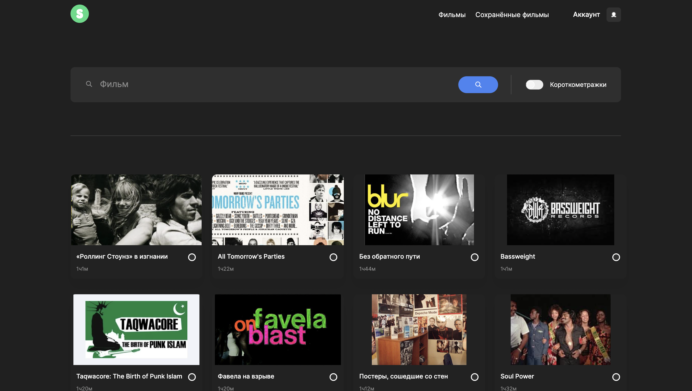

<h1 align="center">movies-explorer-frontend</h1>

---

<h2>Работа выполнена с использованием технологий:</h2>
<ul>
  <li>
HTML
</li>
  <li>
CSS
</li>
  <li>
JavaScript
</li>
  <li>
Flexbox Layout
</li>
  <li>
Grid Layout
</li>
  <li>
Проект сделан по принципам объектно-ориентированного программирования
</li>
</ul>
<h2>Функциональность фронтенда:</h2>
<ul>
  <li>
Адаптировано под все типы устройств
</li>
  <li>
Добавлена возможность редактирования профиля
</li>
  <li>
Реализовано открытие/закрытие попапов по кнопке
</li>
  <li>
При наведении на элементы-ссылки, меняется прозрачность</li>
  <li>
Реализована функция, для сохранения понравившегося фильма</li>
  <li>
Добавлена возможность удаления фильма</li>
  <li>
Исходные фильмы создаются из массива</li>
  <li>
Добавлена валидация ко всем формам</li>
  <li>
Проект реализован с помощью React</li>
  <li>
Используются хуки, пропсы, эффекты</li>
  <li>
Компоненты построены на функциональном подходе</li>
  <li>
Работает передача контекста</li>
</ul>

# movies-explorer-api

## Основная функциональность:
<ul>
<li>POST /signup — создаёт пользователя с переданными в теле запроса name , email и password</li>
<li>POST /signin — вход в систему по email и password пользователя</li>
<li>GET /signout — выход из системы</li>
<li>GET /users/me — получает профиль пользователя</li>
<li>PATCH /users/me — обновляет профиль пользователя</li>
<li>GET /movies — возвращает все фильмы из базы</li>
<li>POST /movies — создаёт фильм с переданными в теле запроса данными , устанавливает поле owner для
карточки</li>
<li>DELETE /movies/:_id — удаляет фильм по _id</li>
</ul>

## Директории

`/routes` — папка с файлами роутера
`/controllers` — папка с файлами контроллеров пользователя и карточки
`/models` — папка с файлами описания схем пользователя и карточки

## Запуск проекта

`npm run start` — запускает сервер
`npm run dev` — запускает сервер с hot-reload

________________________________

 ## Ссылки на проект

 - <a href="https://github.com/ilkor4/movies-explorer-frontend.git" target="_blank">Сcылка на репозиторий</a>

 - Frontend <a href="https://ilkor4.github.io/movies-explorer-frontend" target="_blank">Ссылка на сайт</a>

 - Backend <a href="https://github.com/ilkor4/movies-explorer-api.git" target="_blank">Ссылка на сайт</a>

## Ссылки на макет
https://yadi.sk/d/lFSNEfxxdjCoFQ

<h2>Над проектом работал:</h2>
<h3><a href="https://github.com/ilkor4" target="_blank">Il.kor</a></h3>
